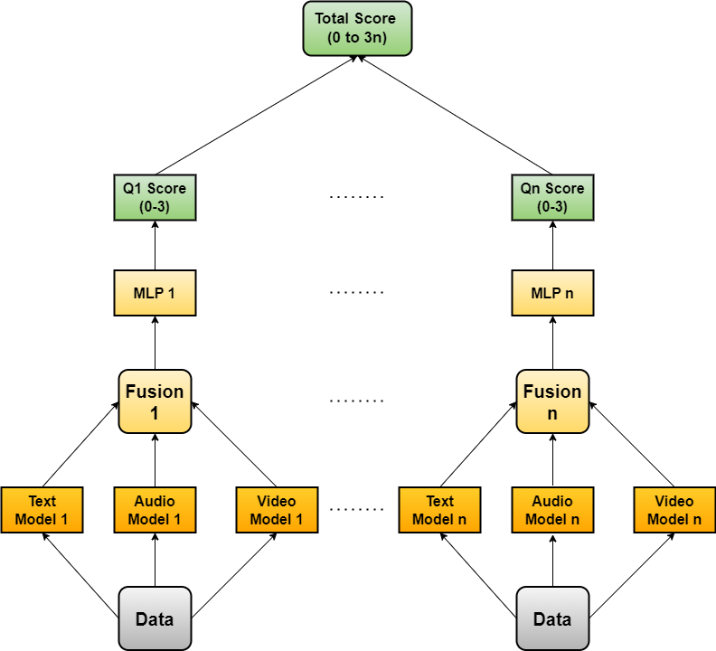

# Enhancing Depression Detection via Question-wise Modality Fusion
<p align="center">

</p>

## Summary

This codebase provides the scripts used in the experiments of the 2025 CLPsych paper "[Enhancing Depression Detection via Question-wise Modality Fusion](https://aclanthology.org/2025.clpsych-1.4.pdf)". In our work, we try to predict the PHQ-8 scores from recorded interviews in the E-DAIC dataset. A PHQ-8 questionnaire contains 8 questions about depression symptoms, each scored from 0-3 depending on how frequently a person encounters them. This gives a total score in the range of 0-24. Here, we experiment with the _QuestMF_ framework.

_QuestMF_: Here, we train separate models to predict the score for each question in the questionnaire using session inputs. We sum the scores from each question to get the total questionnaire score. This framework includes 8 single modality encoders for each modality and 8 fused models corresponding to the 8 questions in a PHQ-8 questionnaire. We train each ecoder using a novel _ImbOLL_ loss function to consider imbalanced ordinal classification. The _ImbOLL_ loss function is defined as follows:

```math
\mathcal{L}_{ImbOLL-\alpha,\beta} = -\sum_{i=1}^{N}log(1-p_i)d(y,i)^{\alpha}w(y)^{\beta}
```
where $y$ is the actual class, $p_i$ is the predicted probability of class $i$, $\alpha$ and $\beta$ are hyperparameters and $d(y,i)$ is the distance between the classes $y$ and $i$ which is defined as:
```math
d(y,i) = |y - i|
```
and $w(y)$ is the weight for class $y$ used for punishing mistakes in rare clases more harshly. It is defined as: 
```math
w(y) = \frac{n_T}{n_y}
```
## Abstract

Depression is a highly prevalent and disabling condition that incurs substantial personal and societal costs. Current depression diagnosis involves determining the depression severity of a person through self-reported questionnaires or interviews conducted by clinicians. This often leads to delayed treatment and involves substantial human resources. Thus, several works try to automate the process using multimodal data. However, they overlook the following: i) The variable contribution of each modality for each question in the questionnaire and ii) Using ordinal classification for the task. This results in sub-optimal fusion and training methods.
In this work, we propose a novel Question-wise Modality Fusion (\textit{QuestMF}) framework trained with a novel \textit{ImbOLL} function to tackle these issues. The performance of our framework is comparable to the current state-of-the-art models on the E-DAIC dataset and enhances interpretability by predicting scores for each question. This will help clinicians identify an individual’s symptoms, allowing them to customise their interventions accordingly.

## Dataset

For this work, we use the E-DAIC dataset from the AVEC-2019 challenge. The dataset can be requested here: https://dcapswoz.ict.usc.edu/
<br>
Once the request form is filled out, the researcher will receive a link for the dataset. The data can be downloaded by simply using ```wget --recursive --no-parent link_to_dataset```.

## Contact
For any questions contact: [Aishik Mandal](mailto:aishik.mandal@tu-darmstadt.de) <br>
[UKP Lab](https://www.informatik.tu-darmstadt.de/ukp/ukp_home/index.en.jsp) | [TU Darmstadt](https://www.tu-darmstadt.de/) 

## Creating the environment

```
python3 -m venv env
source env/bin/activate
pip install -r requirements.txt
```

## Code Structure

The code base contains 7 folders, each containing files for a single combination of modalities. These are elaborated as follows:

- Text: This folder contains codes using only text modality, i.e., they use textual transcript data.
- Audio: This folder contains codes using only audio modality, i.e., they use data from recorded audio files.
- Video: This folder contains codes using only video modality, i.e., they use ResNet features from the recorded videos.
- Text+Audio: This folder contains codes using both text and audio data.
- Text+Video: This folder contains codes using both text and video data.
- Audio+Video: This folder contains codes using both audio and video data
- Text+Audio+Video: This folder contains codes using all the available modalities data, i.e., text, audio and video data.

Each of these folders contains two files:

 - M-questMF.py: Here, M denotes the modalities used and belongs to one of (T,A,V,TA,TV,AV,TAV) depending on the folder. This file is used to train the _QuestMF_ framework. It contains the following arguments:
     - ```-s```: This argument takes the seed for the experiment as input.
     - ```-a```: This argument takes the value of the $\alpha$ hyperparameter in the _ImbOLL_ function as input. Preferable values include {1,1.5,2}.
     - ```-b```: This argument takes the value of the $\beta$ hyperparameter in the _ImbOLL_ function as input. Preferable values include {0.5,1}.
     - ```-d_path```: This argument takes the data path as input. The data path contains the text transcripts files, audio files and video features files.
     - ```-l_path```: This argument takes the label path as input. The label path contains the PHQ-8 scores for the test, validation and test splits. It also contains fine-grained question-wise scores for train and validation splits.
     - ```-m_ckpt```: These arguments take the checkpoints to save and load the trained models. This argument differs depending on the combination of modalities used and is further explained in the respective folders.
     - ```-qno```: Since the _QuestMF_ framework trains 8 different models for each question, this argument inputs the question number for which the model will be trained. It takes an integer value from 0 to 8.
     - ```-m_files```: Some of the data files are missing/incomplete for a certain modality. This argument takes a list of such file numbers as input and ignores them.
     - ```-train```: Whether to train the model or not. If this argument is mentioned, the model will be trained from scratch.
 - M-questMF-eval.py: Here, M denotes the modalities used and belongs to one of (T,A,V,TA,TV,AV,TAV) depending on the folder. This file is used to evaluate the _QuestMF_ framework. It contains the following arguments:
     - ```-s```: This argument takes the seed for the experiment as input.
     - ```-d_path```: This argument takes the data path as input. The data path contains the text transcripts files, audio files and video features files.
     - ```-l_path```: This argument takes the label path as input. The label path contains the PHQ-8 scores for the test, validation and test splits. It also contains fine-grained question-wise scores for train and validation splits.
     - ```-m_ckpt```: These arguments take the checkpoints to save and load the trained models. This argument differs depending on the combination of modalities used and is further explained in the respective folders. The checkpoint path given here should be the same as the checkpoint path given in M-questMF.py.
     - ```-m_files```: Some of the data files are missing/incomplete for a certain modality. This argument takes a list of such file numbers as input and ignores them.
<br>

**Further details on running the scripts are provided in each folder**

## Citation

If you use our code in your research, please cite:
```
@inproceedings{mandal-etal-2025-enhancing,
    title = "Enhancing Depression Detection via Question-wise Modality Fusion",
    author = "Mandal, Aishik  and
      Atzil-Slonim, Dana  and
      Solorio, Thamar  and
      Gurevych, Iryna",
    editor = "Zirikly, Ayah  and
      Yates, Andrew  and
      Desmet, Bart  and
      Ireland, Molly  and
      Bedrick, Steven  and
      MacAvaney, Sean  and
      Bar, Kfir  and
      Ophir, Yaakov",
    booktitle = "Proceedings of the 10th Workshop on Computational Linguistics and Clinical Psychology (CLPsych 2025)",
    month = may,
    year = "2025",
    address = "Albuquerque, New Mexico",
    publisher = "Association for Computational Linguistics",
    url = "https://aclanthology.org/2025.clpsych-1.4/",
    doi = "10.18653/v1/2025.clpsych-1.4",
    pages = "44--61",
    ISBN = "979-8-89176-226-8",
    abstract = "Depression is a highly prevalent and disabling condition that incurs substantial personal and societal costs. Current depression diagnosis involves determining the depression severity of a person through self-reported questionnaires or interviews conducted by clinicians. This often leads to delayed treatment and involves substantial human resources. Thus, several works try to automate the process using multimodal data. However, they usually overlook the following: i) The variable contribution of each modality for each question in the questionnaire and ii) Using ordinal classification for the task. This results in sub-optimal fusion and training methods. In this work, we propose a novel Question-wise Modality Fusion (QuestMF) framework trained with a novel Imbalanced Ordinal Log-Loss (ImbOLL) function to tackle these issues. The performance of our framework is comparable to the current state-of-the-art models on the E-DAIC dataset and enhances interpretability by predicting scores for each question. This will help clinicians identify an individual{'}s symptoms, allowing them to customise their interventions accordingly. We also make the code for the QuestMF framework publicly available."
}
```

## Disclaimer

This repository contains experimental software and is published for the sole purpose of giving additional background details on the respective publication.
